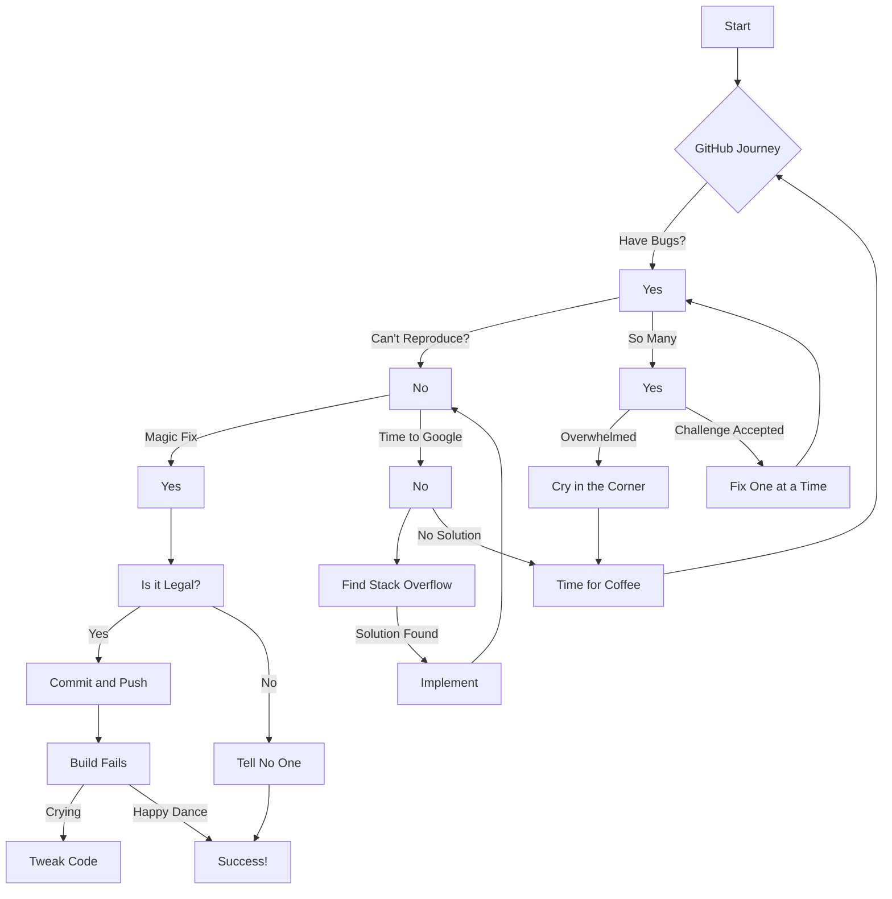

# Hello World!

```c
#include "libft.h"

int main(void)
{
    int excitement = ft_strlen("super excited");
    
    while (excitement--)
        ft_printf("Woo");
    
    ft_printf("!\n");
    ft_printf("Hello, GitHub! I'm a student from 42 Code School.\n");
    ft_printf("Today, I'm here to present my GitHub journey, which has been quite an adventure!\n");
    ft_printf("GitHub has been my trusted companion, like a forever loop, always there to support me in my coding endeavors.\n");
    ft_printf("Thank you for listening, and remember, keep coding, keep pushing, and always embrace the curly braces!\n");
    
    return (0);
}
```

Keep coding, keep laughing, and let the GitHub journey continue!





### [minishell](https://github.com/LuisBalsa/minishell) 

### [so_long](https://github.com/LuisBalsa/so_long) 

### [pipex](https://github.com/LuisBalsa/pipex) 

### [push_swap](https://github.com/LuisBalsa/push_swap) 

### [ft_printf](https://github.com/LuisBalsa/ft_printf)  

### [Libft](https://github.com/LuisBalsa/Libft)  

### [get_next_line](https://github.com/LuisBalsa/get_next_line)  

### [Born2beRoot](https://github.com/LuisBalsa/Born2beRoot)  

### [42_Exam_Level_2](https://github.com/LuisBalsa/42_Exam_Level_2)

### [42_Exam_Level_4](https://github.com/LuisBalsa/42_Exam_Level_4)

